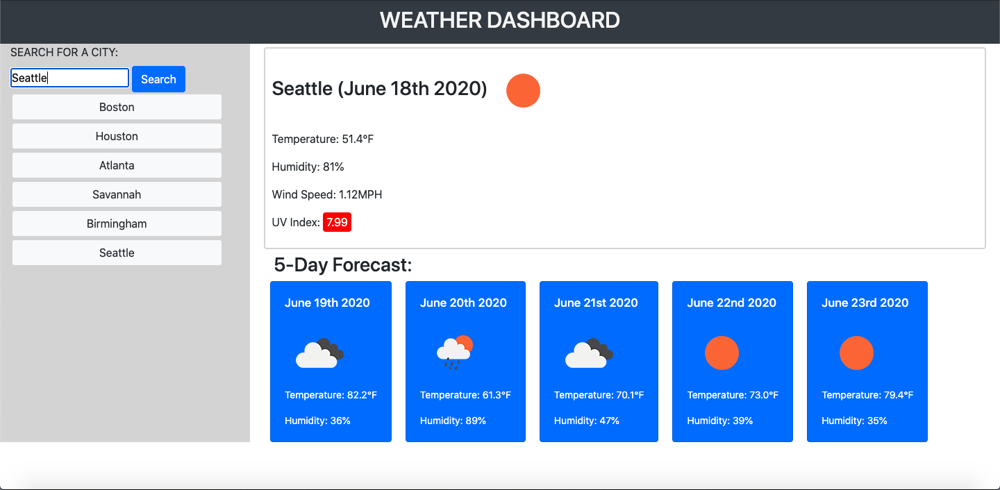

# Weather Forecast Dashboard
Search for weather info by city

---

## Description
Application that runs in browser and provides user with weather info using Openweather API. User searches for any city in the world and receives information on the current day's weather conditions. The app also displays forecast data for the next 5 days. App uses jQuery to dynamically generate HTML elements that contain dynamically manipulated data called from the API.

---

## Table of Contents

* [Installation](#Installation)
* [Usage](#Usage)
* [Images](#Images)
* [Credits](#Credits)
* [Collaborators](#Collaborators)
* [License](#License)

---

## Installation
1. Clone the Github Repository [here](https://github.com/jameygronewald/weatherForecastApp).
2. Open index.html in browser.

---

## Usage
* Visit the deployed app: [Weather Forecast Dashboard](https://jameygronewald.github.io/weatherForecastApp/)
    1. Enter in the name of a city and click "search."
    2. See weather info for the current day displayed, as well as info for the next 5 days in the 5-day forecast section.

---

## Images

---

## Credits
Thanks to Georgia Tech Coding Boot Camp for providing the conceptual design. Thanks to Openweather API, as well.

---

## Collaborators
I, Jamey Gronewald, am the sole collaborator on this project.

---

## License

MIT License

Copyright (c) [2020] [Jamey Gronewald]

Permission is hereby granted, free of charge, to any person obtaining a copy
of this software and associated documentation files (the "Software"), to deal
in the Software without restriction, including without limitation the rights
to use, copy, modify, merge, publish, distribute, sublicense, and/or sell
copies of the Software, and to permit persons to whom the Software is
furnished to do so, subject to the following conditions:

The above copyright notice and this permission notice shall be included in all
copies or substantial portions of the Software.

THE SOFTWARE IS PROVIDED "AS IS", WITHOUT WARRANTY OF ANY KIND, EXPRESS OR
IMPLIED, INCLUDING BUT NOT LIMITED TO THE WARRANTIES OF MERCHANTABILITY,
FITNESS FOR A PARTICULAR PURPOSE AND NONINFRINGEMENT. IN NO EVENT SHALL THE
AUTHORS OR COPYRIGHT HOLDERS BE LIABLE FOR ANY CLAIM, DAMAGES OR OTHER
LIABILITY, WHETHER IN AN ACTION OF CONTRACT, TORT OR OTHERWISE, ARISING FROM,
OUT OF OR IN CONNECTION WITH THE SOFTWARE OR THE USE OR OTHER DEALINGS IN THE
SOFTWARE.
